<!-- 
  =============================================================================
   MOHAMMED AWAIS HUSSAIN (Awais-17) - ELITE CYBERPUNK PROFILE
   Custom engineered with animated SVG dashboards, glowing nodes, and high-tech design.
  =============================================================================
-->

  <!-- ==================== ANIMATED DYNAMIC SVG HEADER ==================== -->
  

    

  <!-- Dynamic Typing Presentation -->
  

    

  <!-- Profile Metrics Row -->
  
  &nbsp;&nbsp;
  

 

  

 

<!-- ═══════════════════════════════ NEURAL MANDALA / BLOOMING UNIFIED FIELD ═══════════════════════════════ -->

  <table border="0" style="border: none; border-collapse: collapse; width: 100%; max-width: 760px; margin: 20px 0;">
    <tr style="border: none;">
      <td align="center" style="border: none; padding: 15px; width: 40%;" valign="middle">
        <!-- Glowing pulsing orbs in background, unfolding mandala in foreground -->
        
      </td>
      <td align="left" style="border: none; padding: 15px; width: 60%;" valign="middle">
        <h3 style="color: #C9B8FF; font-family: 'JetBrains Mono', monospace; margin: 0 0 10px 0;">⚡ Dynamic System Initialization</h3>
        

          The unfolding neural mandala represents the synthesis of the <b>SARA Intelligent Systems</b>. On execution load, the core structure scales up, aligning multi-agent arrays with real-time vector parameters.
        

      </td>
    </tr>
  </table>

<!-- ═══════════════════════════════ CORE CONFIG / IDENTITY ═══════════════════════════════ -->

  <h2>◈ Identity Diagnostic ◈</h2>

  <pre style="background:#0D0B1E;color:#C9B8FF;border:1px solid #2A1F4E;border-radius:10px;padding:22px;font-family:'JetBrains Mono',monospace;font-size:13px;text-align:left;display:inline-block;box-shadow: 0 4px 20px rgba(157, 126, 207, 0.15); max-width: 95%;">
┌──────────────────────────────────────────────────────────────────────────────┐
│                                                                              │
│   $ identity --full --verbose                                                │
│                                                                              │
│   name        →  Mohammed Awais Hussain                                      │
│   alias       →  Awais                                                       │
│   role        →  Agentic AI Engineer  ·  LLM Trainer  ·  Full-Stack Dev     │
│   university  →  Presidency University, Bengaluru  [ B.E. CSE · 2028 ]      │
│   internship  →  NVIDIA × Presidency University  [ AI/ML · GenAI ]         │
│   cert        →  Anthropic API Certified [ Claude / Agents Architecture ]    │
│   community   →  Claude Code Community London  [ CCCL Member ]               │
│                                                                              │
│   ▓▓▓▓▓▓▓▓▓▓▓▓▓▓▓▓▓▓▓░  engineering system state: [ ONLINE ]                 │
│                                                                              │
└──────────────────────────────────────────────────────────────────────────────┘
  </pre>

 

  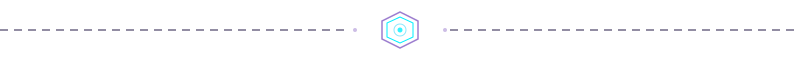

 

<!-- ═══════════════════════════════ SARA ECOSYSTEM SECTION ═══════════════════════════════ -->

  <h2>◈ The SARA Ecosystem Architecture ◈</h2>
  
<i>Click any system node to explore the codebase setup.</i>

  
  <!-- INTERACTIVE ARCHITECTURE GRAPHICS (SVG) -->
  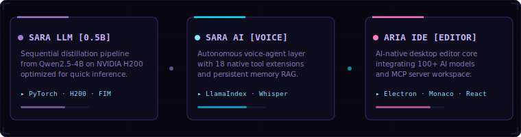

 

  

 

<!-- ═══════════════════════════════ ACHIEVEMENTS ═══════════════════════════════ -->

  <h2>🏆 Achievements & Milestones 🏆</h2>

 

  <table width="92%" style="border-collapse: collapse; border: none;">
    <tr style="border: none;">
      <td align="center" width="25%" valign="top" style="border: none; padding: 10px;">
        
          
        <b>CareAI</b>
        
AI-powered medical triage & lab report summarization

        <code>Groq API</code> &bull; <code>Android</code>
      </td>
      <td align="center" width="25%" valign="top" style="border: none; padding: 10px;">
        
          
        <b>Spot Flaw</b>
        
Automated code bug detection & root cause analyzer

        <code>AI</code> &bull; <code>DevTools</code>
      </td>
      <td align="center" width="25%" valign="top" style="border: none; padding: 10px;">
        
          
        <b>Anthropic Expert</b>
        
Certified specialized builder in Claude agent architecture

        <code>Claude</code> &bull; <code>Agents</code>
      </td>
      <td align="center" width="25%" valign="top" style="border: none; padding: 10px;">
        
          
        <b>GenAI Research</b>
        
Built and optimized custom systems on high-performance accelerators

        <code>AI/ML</code> &bull; <code>GenAI</code>
      </td>
    </tr>
  </table>

 

  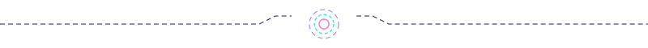

 

<!-- ═══════════════════════════════ HORIZONTAL REVEAL SUB-INFRASTRUCTURE ═══════════════════════════════ -->

  

<!-- ═══════════════════════════════ TECH STACK ═══════════════════════════════ -->

  <h2>🛠️ Technology Matrix 🛠️</h2>
   

  <h3>Languages</h3>
  

    

  <h3>Frameworks & Infrastructure Ecosystem</h3>
  

    

  <h3>AI & Distributed Architectures</h3>
  

    
    &nbsp;
    
    &nbsp;
    
    &nbsp;
    
  

  

    
    &nbsp;
    
    &nbsp;
    
    &nbsp;
    
  

 

  

 

<!-- ═══════════════════════════════ GITHUB STATS ═══════════════════════════════ -->

  <h2>📊 GitHub System Analytics 📊</h2>
   

  <table border="0" style="border: none; border-collapse: collapse; width: 100%;">
    <tr style="border: none;">
      <td align="center" style="border: none; padding: 10px; width: 50%;">
        
      </td>
      <td align="center" style="border: none; padding: 10px; width: 50%;">
        
      </td>
    </tr>
  </table>

    

  

    

  

 

 

  

 

<!-- ═══════════════════════════════ SNAKE ═══════════════════════════════ -->

  <h2>🐍 Contribution Matrix Snake 🐍</h2>
   
  <picture>
    <source media="(prefers-color-scheme: dark)" srcset="https://raw.githubusercontent.com/Awais-17/Awais-17/output/github-snake-dark.svg" />
    <source media="(prefers-color-scheme: light)" srcset="https://raw.githubusercontent.com/Awais-17/Awais-17/output/github-snake.svg" />
    
  </picture>

 

  

 

<!-- ═══════════════════════════════ RETRO ARCADE SUBSYSTEMS ═══════════════════════════════ -->

  <h2>🎮 Retro Arcade Subsystems 🎮</h2>
  
<i>Direct SVG hardware-accelerated animations. CPU/GPU friendly.</i>

   

  <table>
    <tr>
      <td align="center" width="50%">
        <h4>⚡ FLAPPY_BIRD.EXE</h4>
        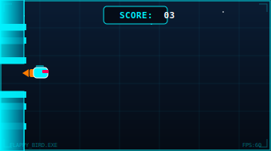
      </td>
      <td align="center" width="50%">
        <h4>⚡ SNAKE_RETRO.SYS</h4>
        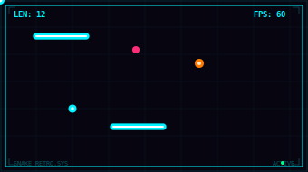
      </td>
    </tr>
  </table>

 

  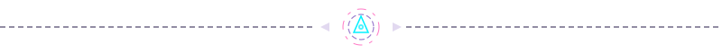

  <h2>◈ Current Terminal Node ◈</h2>

 

  

    

      
      
      
      core@awais-system:~/active
    

    $ pwd 
    ~/projects/active  
    $ ls -la 
    ◈ ARIA-IDE/        # AI-native code editor  [ Electron · React · Monaco · MCP ] 
    ◈ SARA-LLM/        # 0.5B param model  [ NVIDIA H200 · Distillation ] 
    ◈ SARA-AI/         # 18-tool agentic assistant  [ Gemini 2.5 Flash ] 
    ◈ hackathons/      # Always building  [ 2× champion ]  
    $ echo $STATUS 
    "Building things no one asked for yet."  
    $ whoami 
    Mohammed Awais Hussain (mdawaisah@gmail.com) 
    $ _
  

 

  

 

<!-- ═══════════════════════════════ CONNECT ═══════════════════════════════ -->

  <h2>◈ Let's Connect ◈</h2>
   

  
  &nbsp;&nbsp;
  
  &nbsp;&nbsp;
  
  &nbsp;&nbsp;
  
  &nbsp;&nbsp;
  

  

<!-- ═══════════════════════════════ FOOTER ═══════════════════════════════ -->

  
   
  

